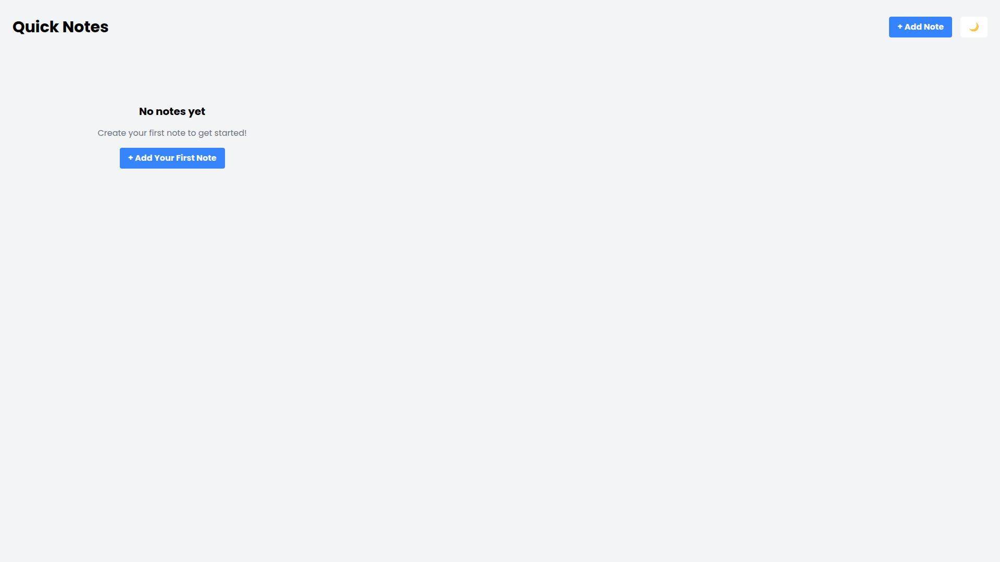
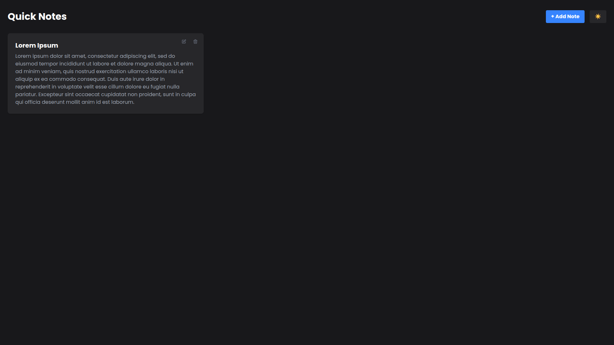
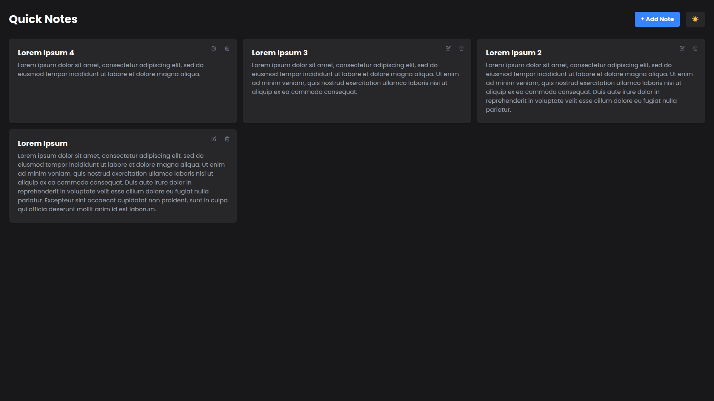
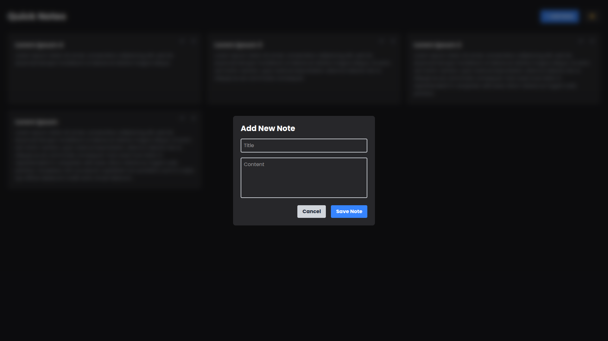
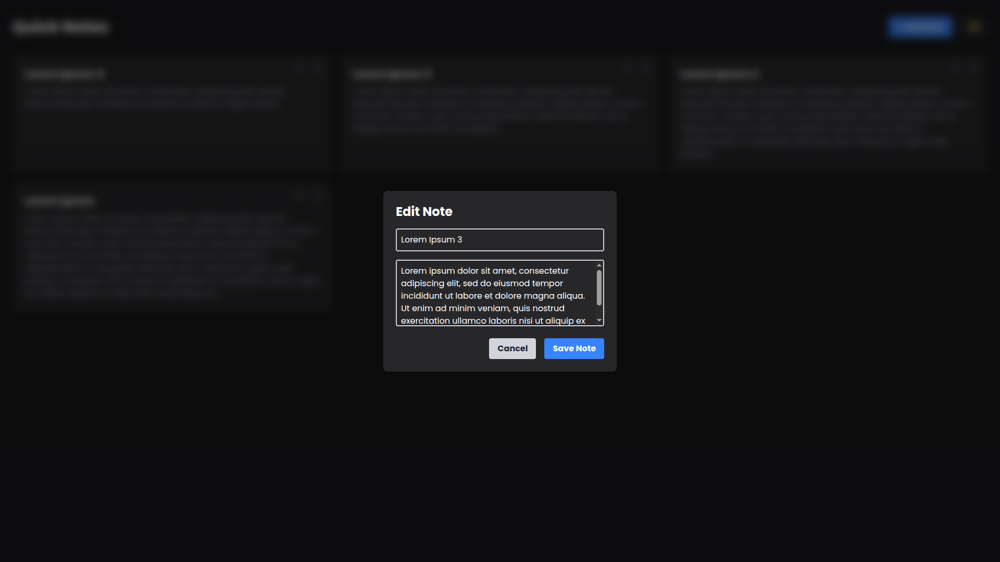
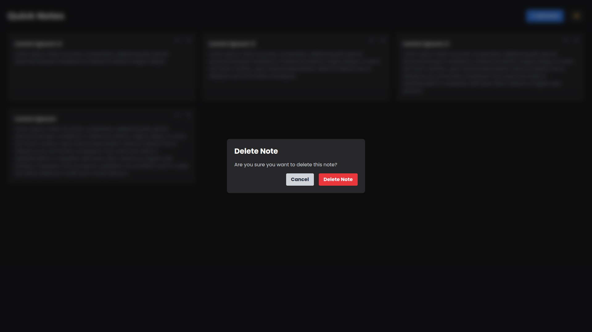
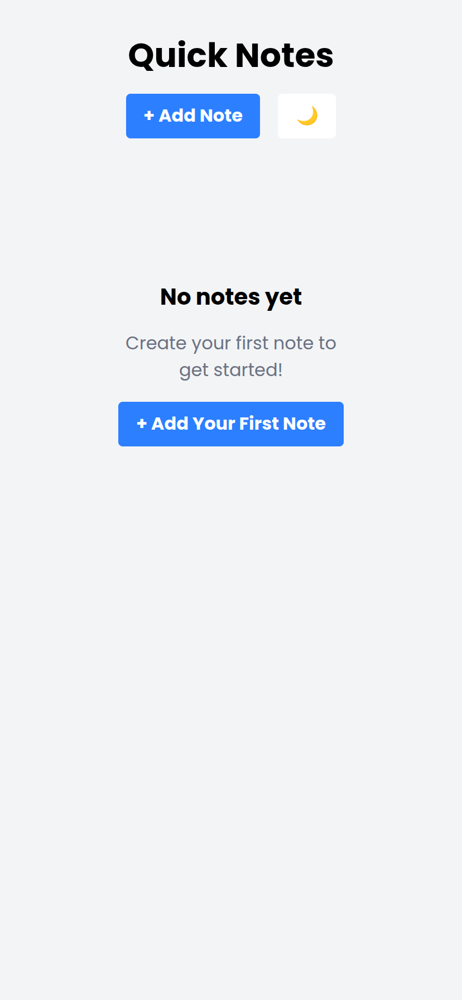
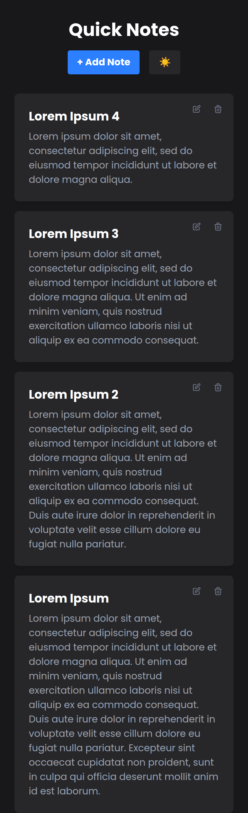

# 📝 Quick Notes - React CRUD Application

This is a fully functional Note-Taking Application built with React.js. It was my first deep dive into modern frontend development, focusing on state management, component architecture, and persistent data storage.
I built this project to practice building a clean, responsive UI that handles real-time user data.

## 🚀 Live Demo

Live Demo: <a href="https://note-app-umber-one.vercel.app" target="_blank">https://note-app-umber-one.vercel.app/</a>

## ✨ Key Features

- **Full CRUD Functionality**: Users can Create, Read, Update, and Delete notes seamlessly.

- **Data Persistence**: Integrated `localStorage` to ensure notes are saved even after the browser is closed or refreshed.

- **Responsive Design**: Built with a "Mobile-First" approach using Tailwind CSS, making it perfectly usable on smartphones, tablets, and desktops.

- **Dynamic UI**: Interactive modal menus for adding, editing, and confirming deletions.

## 🛠️ Tech Stack

**Frontend**: React.js (Hooks: `useState`, `useEffect`)

**Styling**: Tailwind CSS

**Build Tool**: Vite.js

**Deployment**: Vercel (Continuous Deployment via GitHub)

## 🧠 What I Learned

During this project, I strengthened my skills in:

- **State Management**: Handling complex arrays of objects and ensuring UI updates stay in sync with the data.

- **Immutability**: Mastering JavaScript methods like `.map()` and `.filter()` to update the React state without mutating the original data.

- **UI/UX Logic**: Managing conditional rendering for modals and empty states.

- **Deployment Workflow**: Setting up a CI/CD pipeline from a local environment to a production server.

## ⚙️ Installation & Setup

If you want to run this project locally:

Clone the repository:

```bash
git clone https://github.com/zentshalal/note-app.git
```

Install dependencies:

```bash
npm install
```

Start the development server:

```bash
npm run dev
```

## 📸 Screenshots

- **Desktop view**<br/>
  
  
  
  
  
  

- **Mobile view**<br/>
  
  

## 🤝 Contributing

This project was developed as part of my self-taught journey to master full-stack web development fundamentals. Feel free to fork the repository or suggest improvements!

## 📬 Contact

**GitHub**: zentshalal
